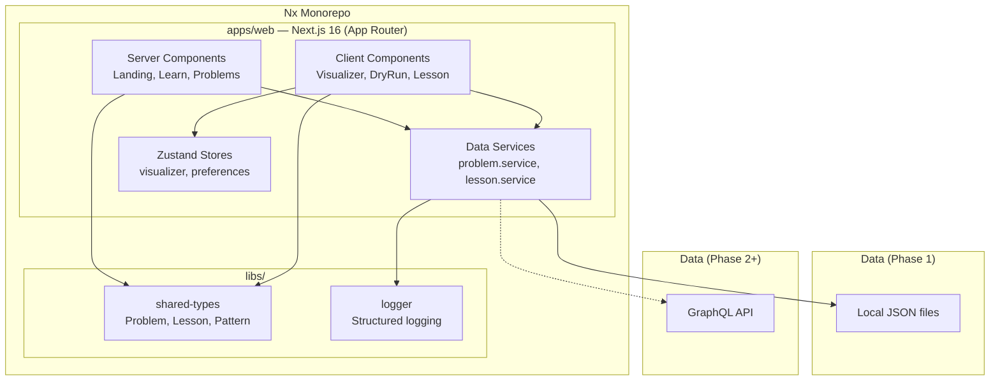

# 🎬 VisuCode

**Learn DSA Visually — Interactive algorithm visualizations with step-by-step dry runs**

[](https://visucode.vercel.app)
[](https://nextjs.org)
[](https://typescriptlang.org)
[](https://nx.dev)
[](https://visucode.vercel.app)

---

## What is VisuCode?

VisuCode is an interactive DSA learning platform that replaces pen-and-paper dry runs with **animated step-by-step algorithm visualizations**. Instead of passively reading solutions, learners watch pointers move, variables update, and arrays transform — exactly as the code executes.

Built as a production-grade startup MVP, not a side project. Server-rendered where possible, client-interactive where needed, with a clear migration path from JSON to GraphQL.

### Who is it for?

- **CS students** preparing for placements and coding interviews
- **Self-taught developers** transitioning into software engineering
- **Anyone** who learns better visually than textually

---

## ✨ Key Features

### 🔍 Interactive Dry Run Viewer

The core feature. Step through any algorithm and watch it execute in real-time:

- **Array visualization** with pointer labels (L, R), sliding windows, swap animations
- **Variable inspector** showing live state changes per step
- **Code highlighting** synchronized to the current execution line
- **Playback controls** — play/pause, speed (0.5x–3x), keyboard shortcuts

### 📚 Animated Lesson Viewer

Visual-first learning with animated concepts:

- Step-by-step array building animations
- Inline mini-exercises (click, choose, type)
- Linked problems for immediate practice

### 💡 Problem Browser

Smart problem discovery:

- Filter by difficulty, pattern, and category
- Company tags (Amazon, Google, Apple)
- External links to LeetCode, NeetCode
- Real-world use cases for every problem

### ⚡ Performance First

- **Server Components** for all static content (zero JS shipped)
- **Client Components** only for visualizer interactivity
- **CSS Modules** — no runtime CSS-in-JS overhead
- **GPU-accelerated animations** via CSS transforms

---

## 🏗️ Architecture



### Server vs Client Component Split

| Component           | Type   | Why                                |
| ------------------- | ------ | ---------------------------------- |
| Landing page        | Server | Static content, zero JS            |
| Problem description | Server | SEO, no interactivity needed       |
| Filter pills        | Server | URL-based, no state                |
| Dry Run Viewer      | Client | Needs Zustand store + animations   |
| Array Visualizer    | Client | DOM animations, pointer tracking   |
| Step Controller     | Client | Playback state, keyboard shortcuts |
| Lesson Viewer       | Client | Step-through animation state       |

---

## 🧠 Tech Decisions

Every technology choice is justified — no "I just used what I knew":

| Decision                  | Alternative Considered      | Why This Choice                                                                                                              |
| ------------------------- | --------------------------- | ---------------------------------------------------------------------------------------------------------------------------- |
| **Nx Monorepo**           | Turborepo                   | First-class Next.js plugin, `nx-ignore` for Vercel, project graph for dependency analysis                                    |
| **Next.js 16 App Router** | Pages Router, Vite          | Server Components reduce JS bundle, `generateMetadata` for SEO, streaming SSR                                                |
| **Zustand** (~2KB)        | Redux (~8KB), Jotai         | Minimal API, no providers, persist middleware for preferences, tiny footprint                                                |
| **DOM Visualizer**        | Canvas, D3.js               | Accessible (screen readers), CSS animations are GPU-accelerated, lighter bundle. Canvas planned for Phase 5 (1000+ elements) |
| **CSS Modules**           | Tailwind, styled-components | Zero runtime cost, tree-shakeable, co-located with components                                                                |
| **Local JSON → GraphQL**  | Direct DB, REST             | JSON for instant MVP. Service abstraction means swapping to GraphQL = change one file, zero component changes                |
| **URL-based Filters**     | Client state                | Shareable links, SEO-friendly, works without JS                                                                              |

---

## 📁 Project Structure

```
visucode/
├── apps/
│   └── web/                        # Next.js 16 application
│       ├── app/
│       │   ├── page.tsx            # Landing page (Server Component)
│       │   ├── learn/              # Learning tracks & lesson viewer
│       │   ├── problems/           # Problem browser & dry run
│       │   ├── patterns/           # Pattern detail pages
│       │   ├── playground/         # Code playground (coming)
│       │   └── components/
│       │       └── visualizer/     # ArrayVisualizer, StepController, VariableInspector
│       ├── lib/
│       │   ├── services/           # Data abstraction layer
│       │   └── stores/             # Zustand state management
│       └── content/
│           └── problems/           # Problem JSON data
├── libs/
│   ├── shared-types/               # TypeScript interfaces (Problem, Lesson, Pattern)
│   └── logger/                     # Structured logging utility
├── vercel.json                     # Deployment config
└── nx.json                         # Nx workspace config
```

---

## 🚀 Getting Started

### Prerequisites

- **Node.js** ≥ 18
- **npm** ≥ 9

### Install

```bash
git clone https://github.com/suvamAdhikary/visucode.git
cd visucode
npm install
```

### Development

```bash
npx nx dev web           # Start dev server (http://localhost:3000)
npx nx build web         # Production build
npx nx lint web          # Run ESLint
npx nx test shared-types # Run tests
npx nx graph             # Visualize dependency graph
```

### All Available Targets

```bash
npx nx show project web  # See all targets for the web app
```

---

## 🌍 Deployment

Deployed on **Vercel** with automatic deploys on push to `main`.

| Setting          | Value              |
| ---------------- | ------------------ |
| Framework        | Next.js            |
| Root Directory   | _(monorepo root)_  |
| Build Command    | `npx nx build web` |
| Output Directory | `apps/web/.next`   |

### Branch Strategy

```
feature/* → develop (integration) → main (production)
```

- Push to `main` → auto-deploy to [visucode.vercel.app](https://visucode.vercel.app)
- PRs generate preview URLs

---

## 🗺️ Roadmap

### Phase 1 — MVP ✅

- [x] Nx monorepo + shared types + logger
- [x] Landing page with design system
- [x] Learn pages (tracks → lessons → exercises)
- [x] Problem browser with filters
- [x] Dry Run Viewer (array viz + step controller + variable inspector)
- [x] Zustand stores (visualizer + preferences)
- [x] Vercel deployment

### Phase 2 — Content & Patterns

- [ ] Pattern detail pages (`/patterns/two-pointers`)
- [ ] 15+ problems across 5 patterns
- [ ] Monaco code editor integration

### Phase 3 — User System

- [ ] Anonymous progress tracking (localStorage)
- [ ] Auth (NextAuth.js)
- [ ] Premium content gating

### Phase 4 — Backend

- [ ] GraphQL API (swap service layer, zero UI changes)
- [ ] PostgreSQL + Prisma
- [ ] Redis caching

### Phase 5 — Scale

- [ ] Rust → WASM canvas visualizer (1000+ elements)
- [ ] Real-time multiplayer dry runs
- [ ] Analytics dashboard

---

## 📄 License

MIT © [Suvam Adhikary](https://github.com/suvamAdhikary)
