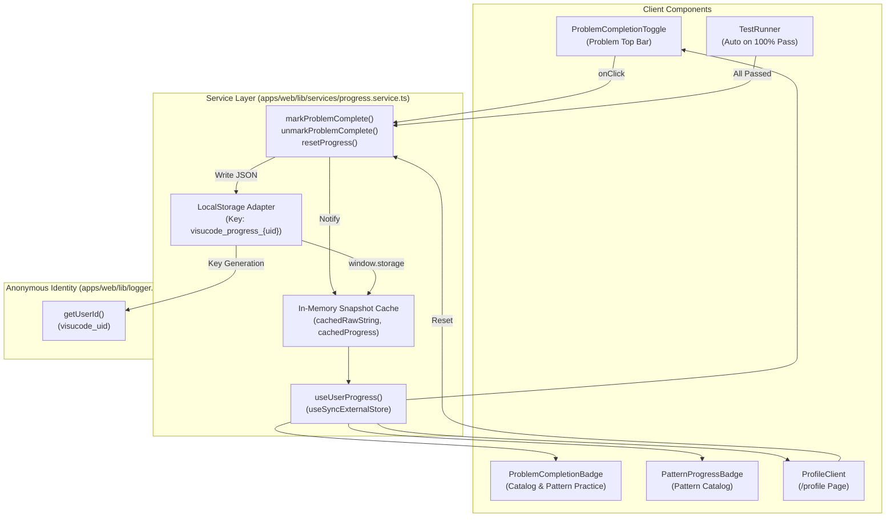

# Phase 3 Sprint 1 — Anonymous Progress Tracking Architecture

## 1. Overview & Scope

Phase 3 Sprint 1 implements client-side, anonymous progress tracking across VisuCode without introducing database or authentication infrastructure prematurely.

### Core Objectives
- **Zero Backend / Zero DB**: All state is persisted locally in the browser.
- **Service Layer Encapsulation ([`F-P3S1-01`](./phase-3-quality-flags.md))**: No UI component touches `localStorage` directly.
- **Single Source of Truth ([`F-P3S1-03`](./phase-3-quality-flags.md))**: Problem completion toggles, catalog cards, pattern progress bars, and the profile page stay perfectly in sync reactively.
- **Hydration & Multi-Tab Parity**: SSR renders without hydration errors, and cross-tab actions update open windows in real-time.
- **Lossless Sprint 2 Ready**: Defines the exact data contract for merging anonymous progress into authenticated accounts in Sprint 2.

---

## 2. Architecture & Data Flow



---

## 3. Data Model & Storage Schema

Stored under `localStorage.getItem('visucode_progress_' + getUserId())`:

```typescript
export interface UserProgress {
  userId: string;              // Persistent UUID (visucode_uid)
  completedProblems: string[]; // Set of completed problem slugs
  completedLessons: string[];  // Set of completed lesson slugs
  currentTrack: string;        // Active learning track (e.g. 'arrays')
  currentLesson: number;       // Current lesson index (e.g. 1)
  role: UserRole;              // 'learner' | 'interviewer' | 'admin' | 'premium'
  preferences: UserPreferences; // Synced with canonical usePreferencesStore (visucode-preferences)
}
```

### Normalization & Resilience
- **Preferences Single Source of Truth**: `UserProgress.preferences` dynamically reflects the live Zustand `usePreferencesStore` (`visucode-preferences`) rather than storing a stale, divergent second copy.
- **Trimming & Validation**: Incoming slugs are string-checked and trimmed.
- **Set Semantics**: Idempotent mutations prevent duplicate entries.
- **Corrupt Storage Recovery**: If `localStorage` contains malformed JSON or non-array fields, `getProgress()` safely falls back to defaults without throwing exceptions or corrupting the user's session.

---

## 4. Reactive State & SSR Synchronization

React 18/19's `useSyncExternalStore` powers `useUserProgress()`:

```typescript
export function useUserProgress(): UserProgress {
  return useSyncExternalStore(
    subscribeProgress,
    getProgress,
    () => SERVER_DEFAULT_PROGRESS
  );
}
```

### Why this design?
1. **Zero Hydration Mismatch**: Next.js Server Components and initial SSR render `SERVER_DEFAULT_PROGRESS`. On hydration, React synchronously syncs the client snapshot without hydration errors.
2. **Referential Stability**: `useSyncExternalStore` requires `getSnapshot` to return referentially identical references if storage hasn't changed. Our in-memory cache (`cachedRawString` and `cachedProgress`) avoids allocating new objects on every render cycle.
3. **Cross-Tab Synchronization**: A global `window.addEventListener('storage', ...)` invalidates the snapshot cache and triggers store re-evaluation whenever progress is modified in another browser tab.

---

## 5. Client vs. Server Service Separation

Next.js Turbopack strictly analyzes module boundaries:
- **Server Services** (`problem.service.ts`): Uses Node.js `fs/promises` to read problem JSON files. Cannot be imported by any Client Component (`'use client'`).
- **Client Services** (`progress.service.ts`): Marked `'use client'`. Manages browser-local progress and React hooks.
- **Server-to-Client Data Bridging**: Server Components (`apps/web/app/profile/page.tsx`) call `listProblems()` and `listPatterns()` on the server, passing problem metadata as props into `<ProfileClient allProblems={...} patterns={...} />`.

---

## 6. Components & Integrations

| Component | Path | Function |
| --- | --- | --- |
| **`ProblemCompletionToggle`** | `apps/web/app/problems/[slug]/ProblemCompletionToggle.tsx` | Interactive "Mark as Done" / "Completed ✓" button in problem top bar. |
| **`TestRunner` Integration** | `apps/web/app/components/editor/TestRunner.tsx` | Auto-completes problem when `totalFailed === 0 && totalPassed > 0`. |
| **`ProblemCompletionBadge`** | `apps/web/app/problems/ProblemCompletionBadge.tsx` | Displays `✓ Solved` tag on catalog cards and pattern problem lists. |
| **`PatternProgressBadge`** | `apps/web/app/patterns/PatternProgressBadge.tsx` | Shows `X / N solved` pill on pattern catalog cards. |
| **`ProfilePage` & `ProfileClient`** | `apps/web/app/profile/` | Solved problem counts, Easy/Medium/Hard breakdown, pattern mastery, and progress reset. |
| **`Navbar`** | `apps/web/app/components/layout/Navbar.tsx` | Profile navigation entry (`👤 Profile`). |

---

## 7. Quality Flags Verification

| Flag | Requirement | Verdict | Implementation Evidence |
| --- | --- | --- | --- |
| **`F-P3S1-01`** | Progress only through service layer | `FIXED` | 0 components call `localStorage`. State accessed via `progress.service.ts`. |
| **`F-P3S1-02`** | Wrong slug / lost set on refresh | `FIXED` | `progress.service.spec.ts` (10 test cases proving idempotency, refresh simulation, corrupt recovery). |
| **`F-P3S1-03`** | Profile matches catalog completions | `FIXED` | `profile-page.spec.tsx` & `problem-completion.spec.tsx` verify identical data derivation. |
| **`F-P3S1-04`** | `next-env.d.ts` / generated files | `FIXED` | **0 diff** vs `main`. |

---

## 8. Sprint 2 (Identity & Auth.js) Migration Contract

When Auth.js (GitHub/Google sign-in) is introduced in Sprint 2:
1. The anonymous progress in `localStorage.getItem('visucode_progress_' + anonUid)` will be inspected upon initial login.
2. An automatic **lossless set union** will merge anonymous completions onto the authenticated user session:
   ```typescript
   mergedProblems = Array.from(new Set([...anonymousCompleted, ...remoteCompleted]));
   mergedLessons = Array.from(new Set([...anonymousLessons, ...remoteLessons]));
   ```
3. Existing progress in browser will never be lost on login.
