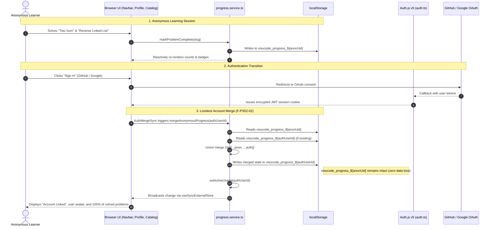

# Phase 3 Sprint 2 — Identity & Account Merge Architecture

## 1. Executive Summary

Phase 3 Sprint 2 establishes developer identity and account management for VisuCode while maintaining the zero-throwaway-code architectural roadmap.

Following **Option A** as defined in [`docs/phase-3-quality-flags.md`](./phase-3-quality-flags.md) and [`docs/ADR/004-authjs-v5-identity-and-merge.md`](./ADR/004-authjs-v5-identity-and-merge.md):
- **Auth.js NextAuth v5** (`next-auth@^5.0.0-beta.32`) is adopted for Next.js 16 and React 19 compatibility (`F-P3S2-01`).
- **JWT Session Strategy** (`session: { strategy: 'jwt' }`): Sessions are stateless, signed with `AUTH_SECRET`, requiring zero database infrastructure in Sprint 2.
- **GitHub & Google OAuth 2.0 Providers** (`F-P3S2-03`): Environment-driven authentication with zero hardcoded credentials.
- **Lossless Anonymous Account Merge Engine** (`F-P3S2-02`): Solved problems and completed lessons accumulated anonymously seamlessly merge into the authenticated account on login via set union semantics. Anonymous records are preserved.
- **Zero Problem GraphQL / Zero Prisma** (`F-P3S2-04`): Problem catalogs remain file-backed JSON (`PROBLEM_INDEX`).

---

## 2. Architecture & Data Flow

---

## 3. Core Modules & Responsibilities

| File Path | Layer | Responsibility |
| --- | --- | --- |
| [`apps/web/auth.ts`](file:///d:/mh/projects/visucode/apps/web/auth.ts) | Server Auth | Configures NextAuth v5, OAuth providers (GitHub, Google), JWT callbacks, and secret resolution. Enforces production secret guards. |
| [`apps/web/app/api/auth/[...nextauth]/route.ts`](file:///d:/mh/projects/visucode/apps/web/app/api/auth/[...nextauth]/route.ts) | API Route | Re-exports NextAuth route handlers (`GET`, `POST`). |
| [`apps/web/app/components/auth/AuthProvider.tsx`](file:///d:/mh/projects/visucode/apps/web/app/components/auth/AuthProvider.tsx) | Client Root | Wraps React tree with `SessionProvider` and `AuthMergeSync`. |
| [`apps/web/app/components/auth/AuthMergeSync.tsx`](file:///d:/mh/projects/visucode/apps/web/app/components/auth/AuthMergeSync.tsx) | Client Engine | Watches session status transitions and calls `mergeAnonymousProgress` or `clearActiveUserId`. |
| [`apps/web/lib/hooks/useSafeSession.ts`](file:///d:/mh/projects/visucode/apps/web/lib/hooks/useSafeSession.ts) | Client Hook | Resilient session accessor avoiding unhandled provider exceptions in isolated tests and Storybook. |
| [`apps/web/lib/services/progress.service.ts`](file:///d:/mh/projects/visucode/apps/web/lib/services/progress.service.ts) | Data Layer | Encapsulates storage, active user context, set union merge, cache invalidation, and reactivity. |
| [`apps/web/app/components/layout/Navbar.tsx`](file:///d:/mh/projects/visucode/apps/web/app/components/layout/Navbar.tsx) | Header UI | Renders user avatar, username, and Sign In / Sign Out actions. |
| [`apps/web/app/profile/ProfileClient.tsx`](file:///d:/mh/projects/visucode/apps/web/app/profile/ProfileClient.tsx) | Profile UI | Displays session identity, provider badge, Account ID, and sync notice. |
| [`/.env.example`](file:///d:/mh/projects/visucode/.env.example) | DevOps | Committed template for local developer authentication setup. |

---

## 4. Conflict Resolution & Merge Specifications

When an anonymous user signs into an authenticated account, the merge follows strict algebraic properties:

1. **Problems (`completedProblems`)**:
   - `Union(Set(anon), Set(account))`
   - Idempotent: `Merge(A, B) == Merge(B, A)`
   - No duplicates, empty slugs rejected.
2. **Lessons (`completedLessons`)**:
   - `Union(Set(anon), Set(account))`
3. **Current Position**:
   - `currentTrack`: Account track takes precedence if already set on this machine (`hasStoredProgressForUser`); otherwise anonymous track wins (e.g. anonymous trees track is preserved on first login).
   - `currentLesson`: `Math.max(anon.currentLesson, account.currentLesson)`.
4. **Preferences**:
   - Live preferences (`usePreferencesStore`) always reflect user customizations.
5. **Lossless Guarantee**:
   - The anonymous key `visucode_progress_${anonId}` is retained in `localStorage`. If the user signs out, their anonymous history remains intact.

---

## 5. Security & Secret Handling (`F-P3S2-03`)

- **Zero committed secrets**: Production and developer credentials live exclusively in `.env.local` or deployment platform secrets (Vercel / GitHub Secrets).
- **Gitignore Protection**: `.env`, `.env.local`, `.env.production` are strictly ignored in `.gitignore`.
- **JWT Signature & Production Enforcment**: Tokens are signed using `AUTH_SECRET`. In production (`NODE_ENV === 'production'`), `AUTH_SECRET` or `NEXTAUTH_SECRET` is strictly required; fallbacks are disallowed in production to prevent signing tokens with a known public string. Fallback developer credentials are only provided when running locally in development or test.

---

## 6. Forward Compatibility to Phase 4

In Phase 4, VisuCode introduces PostgreSQL, Prisma ORM, and GraphQL.
Because all progress reads, writes, and merges flow strictly through `progress.service.ts`, upgrading to cloud database storage requires only swapping the persistence adapter inside `progress.service.ts`:
- Client components (`ProfileClient`, `Navbar`, `ProblemCompletionToggle`) require **0 code changes**.
- The `mergeAnonymousProgress` algorithm transitions from local union to a GraphQL `mergeProgress` mutation with the identical signature.
